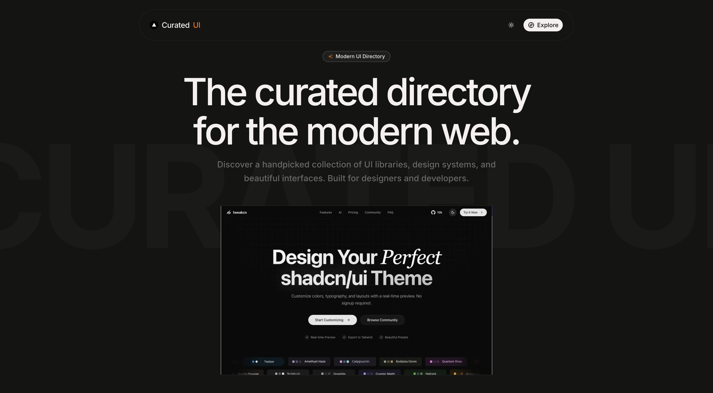

# Curated UI



Curated UI is a beautifully crafted directory of the best UI components, design systems, typography pairings, animations, and web design resources. It's designed to be a one-stop reference for developers and designers building modern web interfaces.

## Features

- 🎨 **Curated Resources:** Hand-picked sites categorized by UI Components, Typography, Design Systems, Animation, and more.
- 🛠️ **Modern Tech Stack:** Built using the latest Next.js features, Tailwind CSS v4, and beautifully composed shadcn/ui components.

## Getting Started

### 1. Installation

Clone the repository and install the dependencies using [Bun](https://bun.sh/):

```bash
bun install
```

### 2. Fetch Images (Optional/First Setup)

If you're missing the site screenshots (or just added new sites to `src/content/data.js`), run the automated screenshot fetcher. This uses Puppeteer to take headless screenshots of every site on your list that doesn't already have a local image.

```bash
bun run fetch-images
```

_Note: Images are saved locally to bypass the need for external API proxying during runtime._

### 3. Run the Development Server

Start the local development server:

```bash
bun dev
```

Open [http://localhost:3000](http://localhost:3000) with your browser to see the result.

## Tech Stack

- **Framework:** [Next.js](https://nextjs.org/)
- **Styling:** [Tailwind CSS v4](https://tailwindcss.com/)
- **Components:** [shadcn/ui](https://ui.shadcn.com/)
- **Icons:** [Tabler Icons](https://tabler.io/icons)
- **Animations:** [Motion](https://motion.dev/)
- **Automation:** [Puppeteer](https://pptr.dev/) (For capturing high-quality resource screenshots)

## How to add a new resource

1. Open `src/content/data.js`.
2. Add a new object to the `sites` array containing the `name`, `url`, `category`, `description`, and a unique `imageSlug`.
3. Run `bun run fetch-images` to automatically capture its screenshot.
4. Your new resource is now fully integrated!
